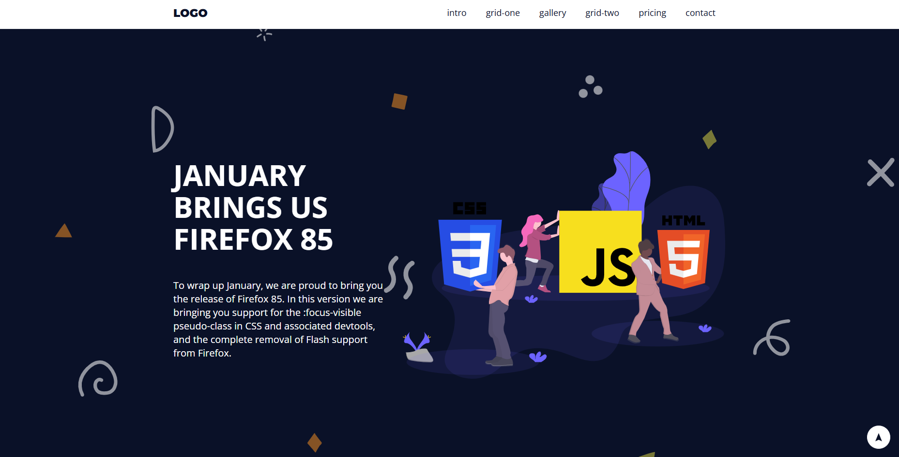

# 🌐 Landing Page - Projeto de Estudo

Este é um dos meus primeiros projetos de landing page, desenvolvido para praticar os novos conceitos que aprendi de CSS. Na estrutura foram utilizados textos fictícios para garantir o foco na organização visual.

## 🎯 Objetivo do projeto
Praticar:
- Posicionamento e estilização de elementos
- Uso de classes e organização no CSS
- Posicionamento com Grid e Flexbox

## 📷 Captura de tela

[ visualizar o projeto.](https://alvarenga-io.github.io/landing-page)

